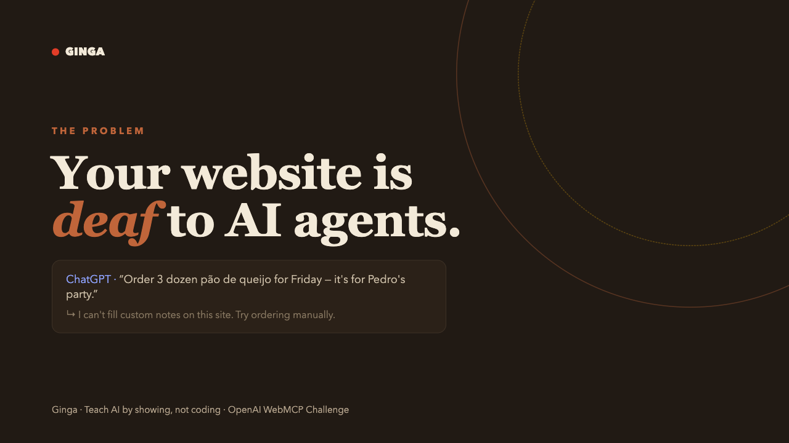
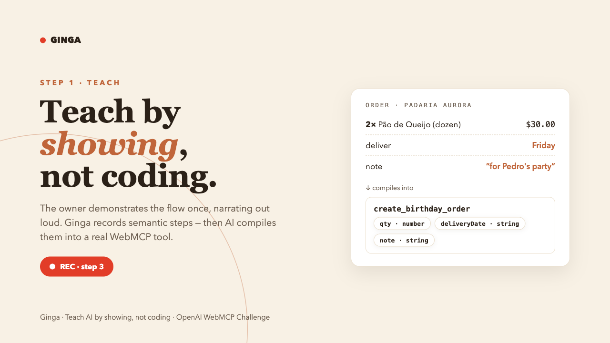
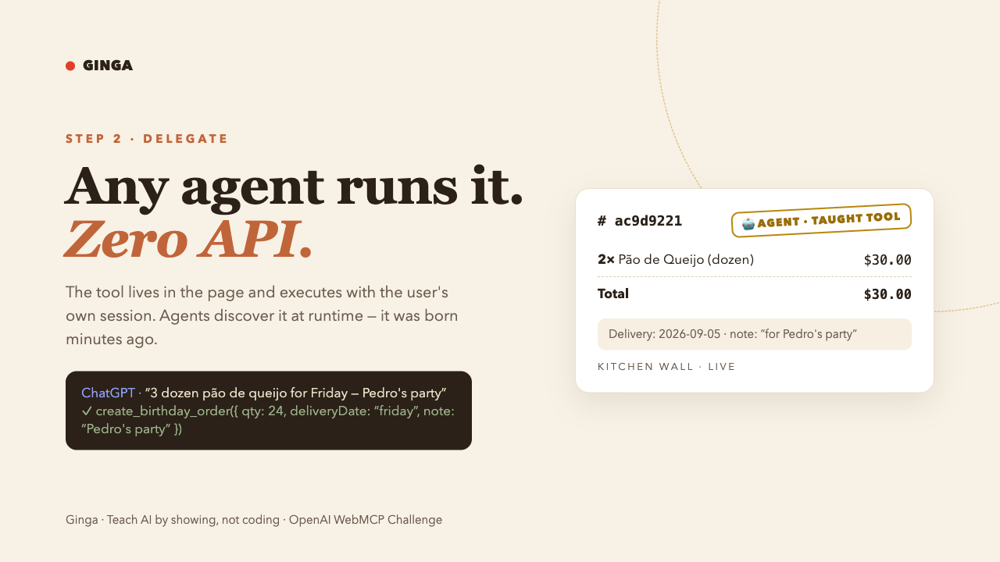
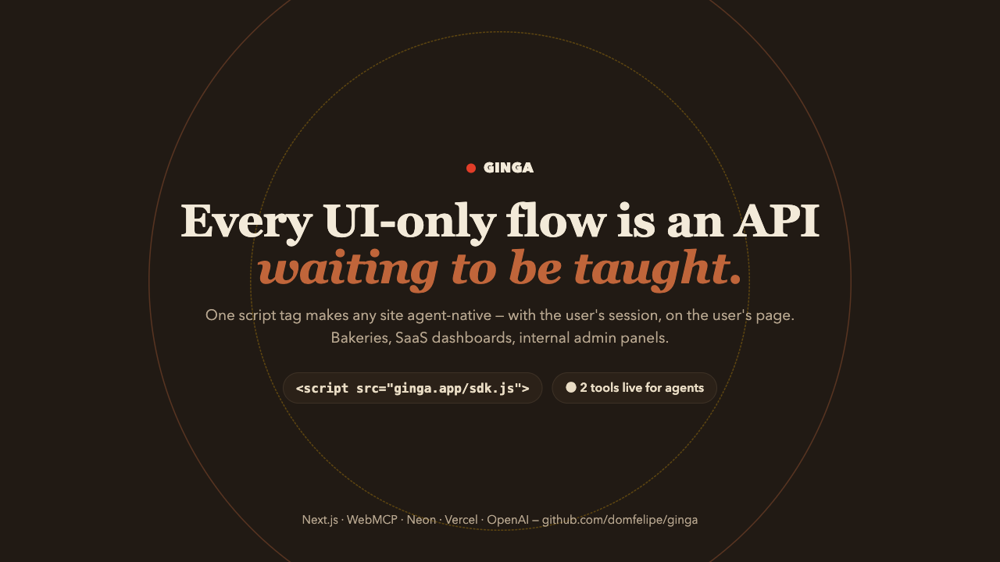
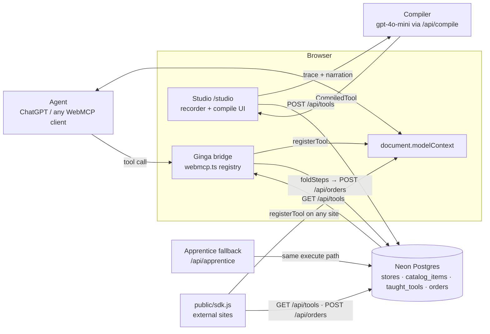

# Ginga

**Ginga** turns website flows into AI-agent tools by demonstration, not code. Order pão de queijo like a human once — and that exact flow becomes a live [WebMCP](https://github.com/openai/webmcp) tool any agent can call, on your site or anywhere. Built for the **OpenAI WebMCP Challenge** by DomHubs.

*Live demo capture lands with the submission video. Until then, the story in four frames:*

<p align="center">
  
  
</p>
<p align="center">
  
  
</p>

## How it works (3 steps)

1. **Demonstrate** — hit "Teach a new tool" in the `/studio`, then walk the store normally: open the menu, add items, set delivery, place the order. Ginga's recorder captures every action as an intent step (`add_item`, `set_delivery`, `set_note`, …).
2. **Compile** — describe what you did in one sentence. An LLM compiler turns the trace + narration into a typed tool: `name`, `description`, JSON-Schema `inputSchema`, and the recorded `steps` with `{{placeholders}}`. Review, edit defaults, save.
3. **Delegate** — the tool is registered **at runtime** with `document.modelContext` (no reload, no redeploy). Agents — or Ginga's own Apprentice chat on plain browsers — call it; Ginga folds the steps into an order and POSTs it to `/api/orders` with `channel: "agent"`.

## Why WebMCP

Traditional agent integrations require a programmer to write and ship a tool for every action. WebMCP inverts this: the browser exposes a `document.modelContext` runtime where pages register tools dynamically. Ginga leans fully into that — **a non-programmer teaches a tool by doing**, and it is live for agents in seconds. No plugin store, no deployment cycle, no code. The same taught tool also runs outside the browser runtime: export an embed snippet (`<script src="…/sdk.js" data-store="aurora"></script>`), download `tool.json`, or just `curl /api/tools`.

## Architecture



**Data flow:** demonstrate → compile → persist (`taught_tools`) → register (`modelContext`) → agent call → `foldSteps` → priced order (`orders`, `channel: 'agent'`).

Extended write-up: [docs/architecture.md](docs/architecture.md).

## Run locally

Prerequisites: **Node 20+**, **pnpm**, a **Neon** Postgres database (DATABASE_URL), an **OpenAI API key**.

```bash
pnpm install
cp .env.example .env.local   # then fill in the values
pnpm dev                     # http://localhost:3000
pnpm test                    # vitest unit suite (npx vitest run)
```

Apply the database schema in `db/0001_init.sql` to your Neon database (seed data included in the same file).

Environment variables (`.env.local`):

| Variable                | Purpose                                                        |
| ----------------------- | -------------------------------------------------------------- |
| `DATABASE_URL`          | Neon Postgres connection string (schema in `db/0001_init.sql`) |
| `OPENAI_API_KEY`        | Powers the compiler (`/api/compile`) and the apprentice (`/api/apprentice`) |
| `NEXT_PUBLIC_SITE_URL`  | Optional. Public origin printed in the export snippet / OG tags; defaults to `https://ginga-theta.vercel.app` (constant lives in `src/lib/site.ts`) |

## Deploy

Import the repo on [Vercel](https://vercel.com), set `DATABASE_URL` and `OPENAI_API_KEY`, deploy. Current production: **https://ginga-theta.vercel.app** (Vercel project `ginga`).

## License

[MIT](LICENSE) © 2026 Felipe Domingues / DomHubs
